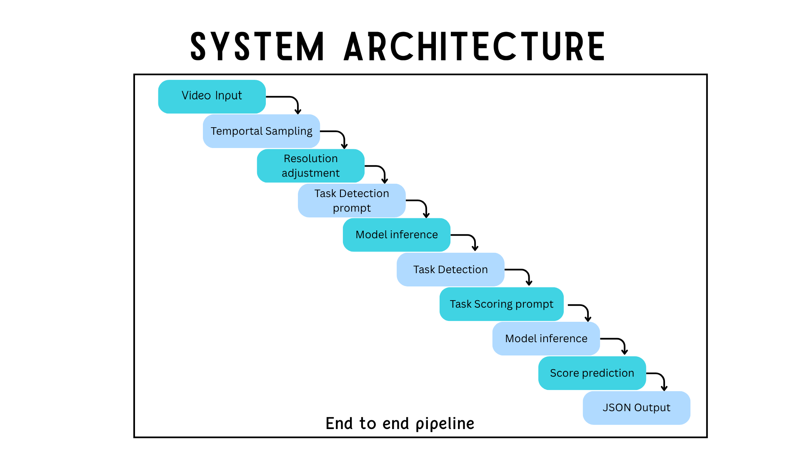
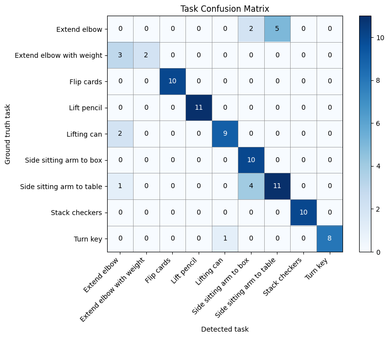
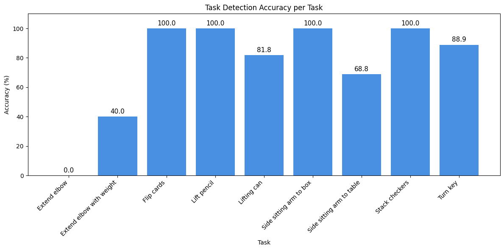
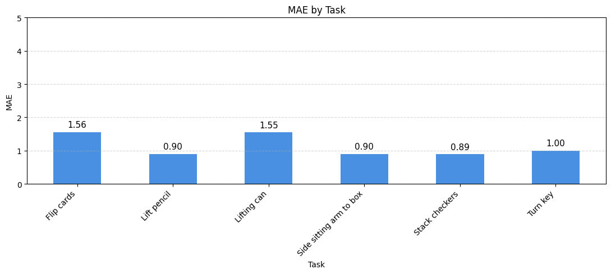
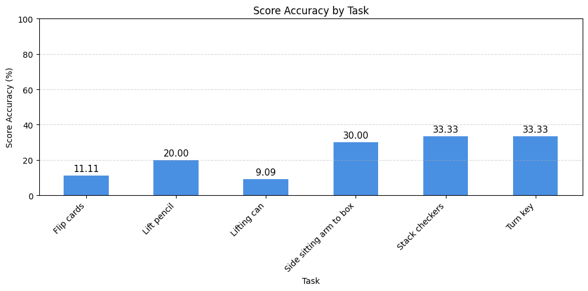
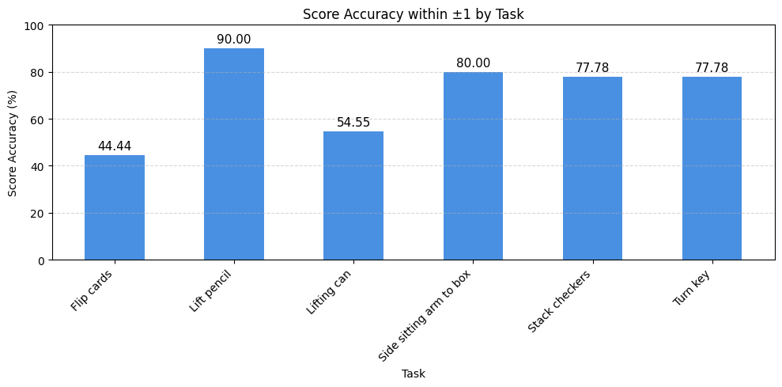

# 🧠 WMFT-VLM-Automation

Automating the Wolf Motor Function Test (WMFT) using Vision Language Models (VLMs) for task recognition and clinical score prediction from patient movement videos.

## 📌 Overview

The Wolf Motor Function Test (WMFT) is a widely used clinical assessment for evaluating upper-extremity motor function after stroke.

This project explores the use of the Qwen2.5-VL Vision Language Model to automatically:

- Detect WMFT tasks from patient videos
- Generate task-specific evaluations
- Predict WMFT functional ability scores
- Compare predicted scores against clinician-provided ground truth

The system uses synchronized multi-view videos (front and side perspectives) and prompt engineering based on the official FAST INdICATE WMFT clinical guidelines.

---

## 🎯 Objectives

- Automate WMFT task recognition using a Vision Language Model
- Reduce manual assessment workload
- Evaluate score prediction performance against clinical ratings
- Investigate the feasibility of VLMs for rehabilitation assessment

---

## 🏗️ System Architecture



### Workflow

1. Input WMFT video
2. Extract synchronized front and side views
3. Detect performed WMFT task using Qwen2.5-VL
4. Apply task-specific clinical prompts
5. Generate predicted WMFT score
6. Compare against clinician ground truth
7. Evaluate performance using classification and regression metrics

---

## 🛠️ Technologies Used

- Python
- Qwen2.5-VL
- Hugging Face Transformers
- PyTorch
- Pandas
- NumPy
- Matplotlib
- Scikit-Learn
- OpenCV

---

## 📊 Results

### Task Detection Confusion Matrix



### Task Detection Accuracy



### Mean Absolute Error (MAE) by Task



### Exact Score Accuracy



### Score Accuracy Within ±1



---

## 🔍 Key Findings

### Task Detection

| Task | Accuracy |
|--------|----------|
| Flip Cards | 100% |
| Lift Pencil | 100% |
| Side Sitting Arm to Box | 100% |
| Stack Checkers | 100% |
| Turn Key | 88.9% |
| Lifting Can | 81.8% |
| Side Sitting Arm to Table | 68.8% |
| Extend Elbow with Weight | 40.0% |
| Extend Elbow | 0.0% |

### Score Prediction

- Lowest MAE: **Stack Checkers (0.89)**
- Highest MAE: **Flip Cards (1.56)**
- Exact score accuracy ranged from **9%–33%**
- Score accuracy within ±1 ranged from **44%–90%**

---

## 📁 Project Structure

```text
WMFT-VLM-Automation
│
├── images/
│   ├── architecture.png
│   ├── confusion_matrix.png
│   ├── task_accuracy.png
│   ├── mae.png
│   ├── score_accuracy.png
│   └── score_accuracyby+1.png
│
├── notebooks/
│   └── wmft_vlm_automation.ipynb
│
├── README.md
├── requirements.txt
├── LICENSE
└── .gitignore
```

---

## 🚀 Installation

Clone the repository:

```bash
git clone https://github.com/Ruchitha98/WMFT-VLM-Automation.git
cd WMFT-VLM-Automation
```

Install dependencies:

```bash
pip install -r requirements.txt
```

---

## 📈 Future Improvements

- Fine-tune VLMs on WMFT-specific datasets
- Improve detection of challenging tasks
- Expand scoring accuracy using temporal video analysis
- Develop a clinician-friendly assessment dashboard
- Explore real-time rehabilitation monitoring

---

## 👨‍💻 Author

### Ruchitha Sampath Weerasekara

MSc Data Science  
University of East Anglia, United Kingdom


---

## 📄 License

This project is licensed under the MIT License.
